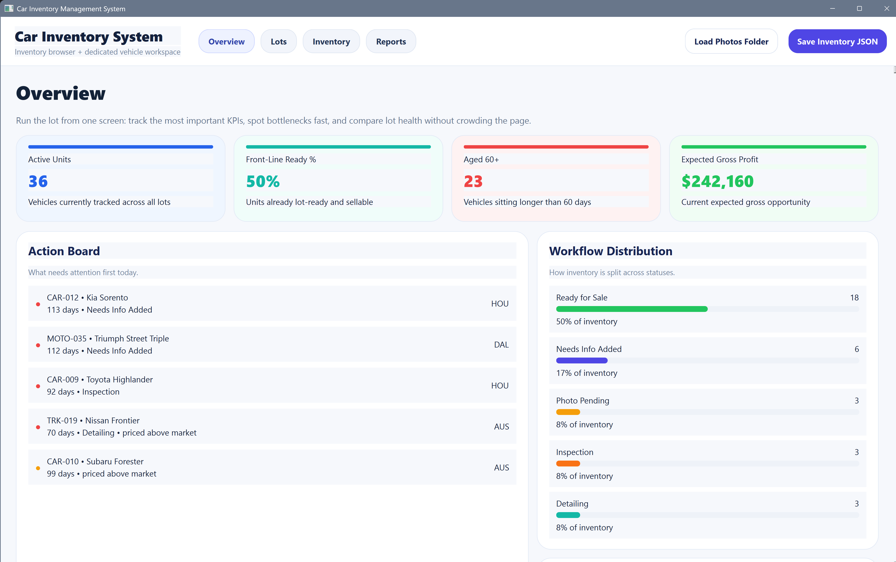
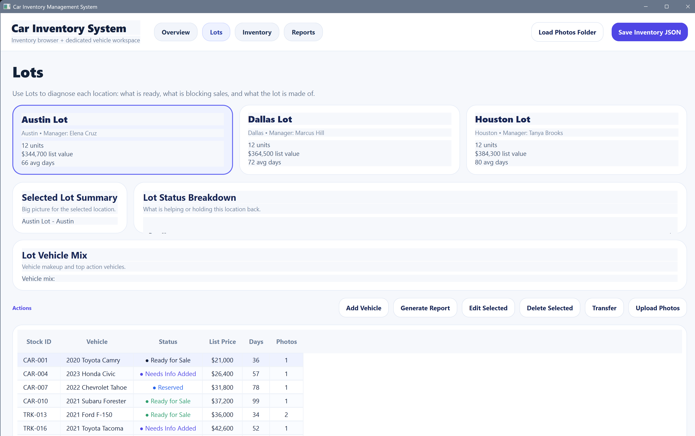
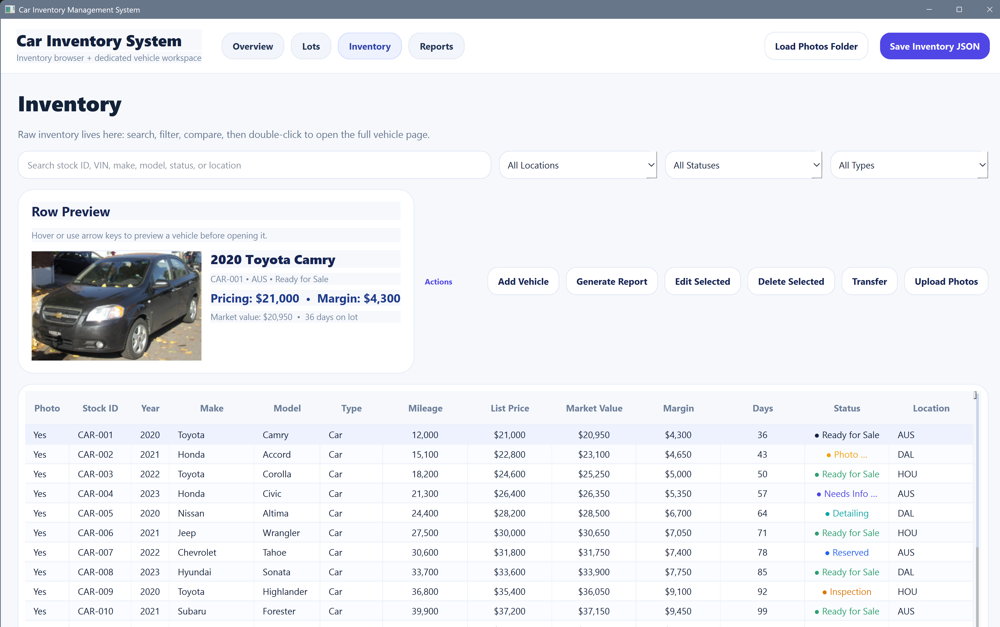
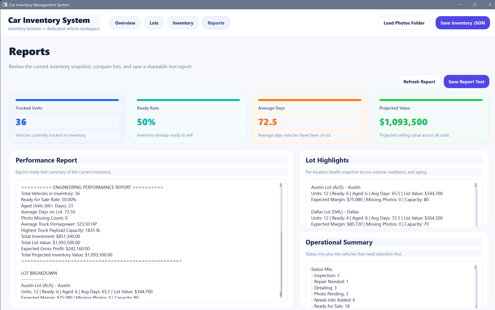

# Vehicle Inventory Desktop App

## Summary
This project is a small Python desktop application for managing a vehicle inventory. It uses PySide6 for the interface and stores inventory data in `inventory.json`.

The app is organized into package modules for models, services, and UI, with `main.py` as the entry point.

## What I Built / What I Learned
This project gave me practice building a desktop UI with PySide6 and organizing a Python application with a more object-oriented structure.

It also helped me work with JSON-based persistence and with separating the project into models, services, and UI modules instead of keeping everything in one file.

## Screenshots
### Overview


### Lots


### Inventory


### Reports


## Key Features
- Load saved inventory data from `inventory.json`
- Seed demo inventory data when no saved inventory is available
- View inventory, lot information, and summary dashboard data
- Add, edit, delete, and transfer vehicles
- Save inventory updates back to JSON
- Generate a simple text performance report

## Technologies Used
- Python
- PySide6
- JSON for local data storage

## Install Dependencies
Install the required package with:

```bash
pip install -r requirements.txt
```

## Run the App
Start the desktop app with:

```bash
python main.py
```

Keep the `images/` folder in the project so the bundled sample vehicle images can load correctly.

## Project Structure
- `inventory_app/models/`: Vehicle, engine, chassis, location, and vehicle-type classes
- `inventory_app/services/`: Inventory logic, analytics, and sample data seeding
- `inventory_app/ui/`: Active PySide6 interface
- `images/`: Bundled sample vehicle images
- `screenshots/`: README screenshots of the app
- `scripts/`: Small utility and test/demo scripts
- `archive/`: Preserved legacy files
- `main.py`: App entry point
- `inventory.json`: Saved inventory data
- `requirements.txt`: Python dependencies

## Legacy GUI Note
The active GUI is in `inventory_app/ui/gui.py`.

`archive/gui_legacy.py` is preserved legacy code from an older root-level GUI file. It is not used by the current app startup path.
